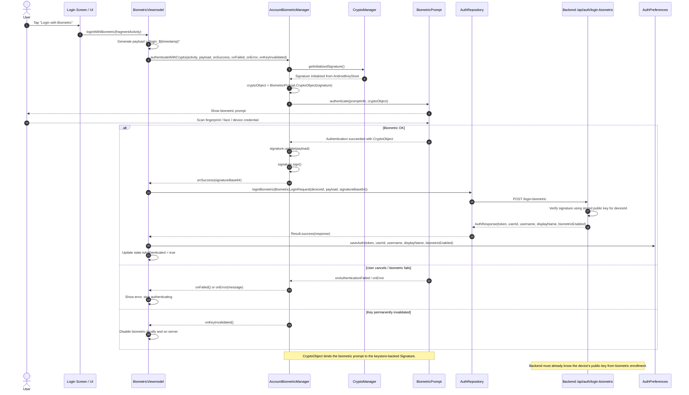

# Biometric Login Flow

```mermaid
sequenceDiagram
    autonumber
    actor User
    participant UI as Login Screen / UI
    participant VM as BiometricViewmodel
    participant AM as AccountBiometricManager
    participant CM as CryptoManager
    participant BP as BiometricPrompt
    participant Repo as AuthRepository
    participant API as Backend /api/auth/login-biometric
    participant Prefs as AuthPreferences

    User->>UI: Tap "Login with Biometric"
    UI->>VM: loginWithBiometric(fragmentActivity)

    VM->>VM: Generate payload = "login_${timestamp}"
    VM->>AM: authenticateWithCrypto(activity, payload, onSuccess, onFailed, onError, onKeyInvalidated)

    AM->>CM: getInitializedSignature()
    CM-->>AM: Signature initialized from AndroidKeyStore
    AM->>AM: cryptoObject = BiometricPrompt.CryptoObject(signature)
    AM->>BP: authenticate(promptInfo, cryptoObject)

    BP-->>User: Show biometric prompt
    User-->>BP: Scan fingerprint / face / device credential

    alt Biometric OK
        BP-->>AM: Authentication succeeded with CryptoObject
        AM->>AM: signature.update(payload)
        AM->>AM: signature.sign()
        AM-->>VM: onSuccess(signatureBase64)

        VM->>Repo: loginBiometric(BiometricLoginRequest(deviceId, payload, signatureBase64))
        Repo->>API: POST /login-biometric

        API->>API: Verify signature using stored public key for deviceId
        API-->>Repo: AuthResponse(token, userId, username, displayName, biometricEnabled)
        Repo-->>VM: Result.success(response)

        VM->>Prefs: saveAuth(token, userId, username, displayName, biometricEnabled)
        VM->>VM: Update state isAuthenticated = true
    else User cancels / biometric fails
        BP-->>AM: onAuthenticationFailed / onError
        AM-->>VM: onFailed() or onError(message)
        VM->>VM: Show error, stop authenticating
    else Key permanently invalidated
        AM-->>VM: onKeyInvalidated()
        VM->>VM: Disable biometric locally and on server
    end

    Note over AM,BP: CryptoObject binds the biometric prompt to the keystore-backed Signature.
    Note over API: Backend must already know the device's public key from biometric enrollment.
```
