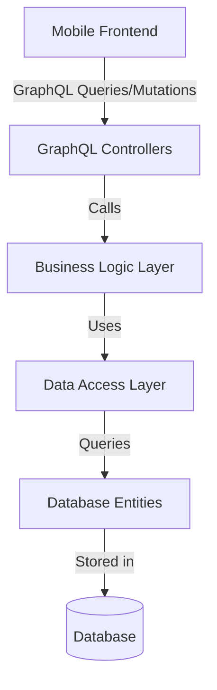

# Backend Architecture: Task Management System

This document describes the high-level architecture of the Task Management backend.

## 1. Overview
The backend is built using **Spring Boot** with **Kotlin**, following a layered architecture pattern and exposing a **GraphQL API**. This ensures a clear separation of concerns and a flexible, type-safe interface for the mobile frontend.

## 2. Core Technologies
- **Language**: Kotlin 2.x
- **Framework**: Spring Boot 4.0 (Spring Framework 6.x)
- **API**: GraphQL (via `spring-boot-starter-graphql`)
- **Persistence**: Spring Data JPA + Hibernate
- **Database**: PostgreSQL / H2 (Development)
- **Security**: Spring Security (JWT-based authentication)

## 3. High-Level Architecture

### 3.1 GraphQL API Layer
Unlike REST, GraphQL allows the frontend to request specifically what it needs. All requests are sent to a single `/graphql` endpoint.
- **Queries**: Used for fetching data (e.g., getting tasks, member lists).
- **Mutations**: Used for modifying data (e.g., creating tags, updating task status).

### 3.2 Logic Layer (Services)
The Service layer contains the core business rules. It performs validations, handles transactions, and orchestrates data across multiple repositories if necessary.

### 3.3 Data Layer (JPA Repositories)
The Data layer abstractly interacts with the database. We use JPA to map Kotlin objects (Entities) to database tables.

## 4. Design Patterns
- **Repository Pattern**: Extends `JpaRepository` for standard CRUD operations and custom queries.
- **DTO Pattern**: While GraphQL types often match entities, we use DTOs where necessary to separate the API contract from the database schema.
- **Service Pattern**: Encapsulates business logic to keep controllers thin.

---

## 5. Development Workflow
1. **Schema Definition**: Update `src/main/resources/graphql/schema.graphqls`.
2. **Entity Implementation**: Create/Update JPA classes in `database/model`.
3. **Repository Implementation**: Create interfaces in `database/repository`.
4. **Service Implementation**: Implement business logic in `services/`.
5. **Controller Implementation**: Bind GraphQL operations in `controllers/` using `@QueryMapping` and `@MutationMapping`.
